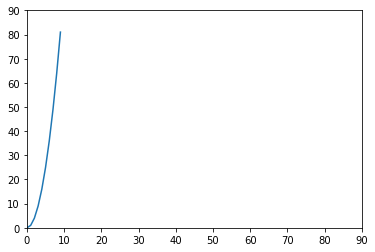

- x축 값과 y축 값의 scale을 꼭 봐야한다. ( scale을 맞추기 위해 Limitation을 이용 )


```python
import numpy as np
import matplotlib.pyplot as plt

x = np.arange(10)
plt.plot(x**2)
plt.xlim(0,90) # scale이 안 맞기에 xlim, ylim을 줌.
plt.ylim(0,90) 
```


    (0.0, 90.0)




---

#### plt.plot의 style 종류
|문자|색상|
|--|--|
|b|Blue|
|g|Green|
|r|Red|
|c|Cyan|
|m|Magenta|
|y|yellow|
|k|Black|
|w|White|

|마커|모양|
|--|--|
|o|Circle|
|IV|Triangle Down|
|^|Triangle Up|
|s|Square|
|+|Plus|
|-|실선|
|--|점선|
|.|Point|


```python
score = [70, 80, 90, 60, 70]
plt.plot(range(5), score, 'ro')  # r은 red(색상) , o는 Circle(모양)

score2 = [80, 80, 90, 80, 60]
plt.plot(range(5), score2, 'b-')

plt.ylim(0, 100)

```


    (0.0, 100.0)


    

    


- 여러 그래프를 겹처 그리기
1. plt.plot(x, y, style, x2, y2, style2 , ...) 
2. plt.plot() 여러번 호출


```python
# 한글 세팅 방법
plt.rcParams['font.family'] = "Malgun Gothic"  # 맑은 고딕
# 한글이 잘 안먹으면 kernel restart

score = [70, 80, 90, 60, 70]
plt.plot(range(5), score, 'ro')  # r은 red(색상) , o는 Circle(모양)

score2 = [80, 80, 90, 80, 60]
plt.plot(range(5), score2, 'b-')
plt.title("한글 테스트")

plt.ylim(0, 100)
```


    (0.0, 100.0)


    

    


- x축 : xticks , y축 : yticks


```python
import pandas as pd

apt_price = pd.read_csv(
    "./아파트(매매)__실거래가_20220401113837.csv",
    skiprows= 15,
    encoding="euc-kr",
    thousands=",")
```


```python
apt_price["평"] = apt_price["전용면적(㎡)"] / 3.03
apt_price.head()
```


```python
apt_price["평형"] = pd.cut(
    apt_price["평"],
    bins=[0,10,20,30,40,50,60,1000], # 구간경계값
    labels=['10평이하', '10평대', '20평대', '30평대', '40평대', '50평대','50평이상']
)
apt_price.head()
```


```python
import numpy as np
apt_price["계약년"] = apt_price["계약년월"] // 100
apt_price["계약월"] = apt_price["계약년월"] % 100
apt_price["계약일"] = np.where(apt_price["계약일"] < 10 ,
        "0" + apt_price["계약일"].astype(str), apt_price["계약일"].astype(str) )
apt_price["계약년월일"] = apt_price["계약년월"].astype(str) + apt_price["계약일"].astype(str) 
apt_price["계약년월일"] = pd.to_datetime(apt_price["계약년월일"])
```


```python
# 시군구를 분할 ~~시 ~~구 ~~동
apt_price["구"] = apt_price["시군구"].str.split().str[1]
apt_price["동"] = apt_price["시군구"].str.split().str[2]


```


```python
import matplotlib.pyplot as plt

plt.rcParams['font.family'] = 'Malgun Gothic'

apt_price[["평","거래금액(만원)"]]
plt.plot(apt_price["평"],apt_price["거래금액(만원)"],'o') # plt에 style만 표시
plt.ylim(20000, 40000)
plt.xlim(20,30)  # 상세히 보고 싶은 구간을 정하면 된다.
```


    (20.0, 30.0)


    

    


```python
import matplotlib.pyplot as plt

plt.rcParams['font.family'] = 'Malgun Gothic'

apt_price[["평","거래금액(만원)"]]
plt.plot(apt_price["평"],apt_price["거래금액(만원)"],'o', label='평형별 거래금액') # plt에 style만 표시
plt.legend()  # legend()는 기본이 best이고 best는 알아서 겹쳐지지 않게 그려줌
```


    <matplotlib.legend.Legend at 0x210ef04a0a0>


    

    


```python
import matplotlib.pyplot as plt

plt.rcParams['font.family'] = 'Malgun Gothic'

apt_price[["평","거래금액(만원)"]]

# 20평대 행 추출
b20 = apt_price["평형"] == "20평대"     # 20평대 행만 가져오기
b30 = apt_price["평형"] == "30평대"     # 30평대 행만 가져오기


plt.plot(apt_price.loc[b20, :]["평"],apt_price.loc[b20, :]["거래금액(만원)"],'o', label='20평대') # plt에 style만 표시

# 30평대 행 추출

plt.plot(apt_price.loc[b30, :]["평"],apt_price.loc[b30, :]["거래금액(만원)"],'o', label='30평대') # plt에 style만 표시
plt.legend()
```


    <matplotlib.legend.Legend at 0x210ef03ba30>


    

    


```python
# 강남 3구의 20평대의 평과 거래금액을 산포도로 그리기
import matplotlib.pyplot as plt

b_gn3 = apt_price["구"].isin(["강남구","서초구","송파구"])
b_gn22 = ~apt_price["구"].isin(["강남구","서초구","송파구"])

b20 = apt_price["평형"] == "20평대"

gn3 = apt_price.loc[b_gn3 & b20, :]
gn22 = apt_price.loc[b_gn22 & b20, :]

plt.rcParams['font.family'] = 'Malgun Gothic'

plt.plot(gn3["평"], gn3["거래금액(만원)"],'o', label='강남 3구 20평대') # plt에 style만 표시
plt.plot(gn22["평"], gn22["거래금액(만원)"],'^', label='강남 3구이외 20평대') # plt에 style만 표시
plt.legend()
```


    <matplotlib.legend.Legend at 0x210eec86640>


    

    


```python
# 강남 3구와 그 외지역의 "거래금액(만원)"의 describe() 함수 결과를 가로로 합친 데이터프레임을 출력해보세요.

gn3_22 = pd.concat([gn3[["거래금액(만원)"]].describe(), gn22[["거래금액(만원)"]].describe()],axis=1)
gn3_22
```


<div>
<style scoped>
    .dataframe tbody tr th:only-of-type {
        vertical-align: middle;
    }

    .dataframe tbody tr th {
        vertical-align: top;
    }

    .dataframe thead th {
        text-align: right;
    }
</style>
<table border="1" class="dataframe">
  <thead>
    <tr style="text-align: right;">
      <th></th>
      <th>거래금액(만원)</th>
      <th>거래금액(만원)</th>
    </tr>
  </thead>
  <tbody>
    <tr>
      <th>count</th>
      <td>1726.000000</td>
      <td>10314.000000</td>
    </tr>
    <tr>
      <th>mean</th>
      <td>201327.782155</td>
      <td>98085.720962</td>
    </tr>
    <tr>
      <th>std</th>
      <td>71799.568944</td>
      <td>37576.892853</td>
    </tr>
    <tr>
      <th>min</th>
      <td>41510.000000</td>
      <td>15000.000000</td>
    </tr>
    <tr>
      <th>25%</th>
      <td>150000.000000</td>
      <td>71000.000000</td>
    </tr>
    <tr>
      <th>50%</th>
      <td>202400.000000</td>
      <td>90000.000000</td>
    </tr>
    <tr>
      <th>75%</th>
      <td>250000.000000</td>
      <td>121762.500000</td>
    </tr>
    <tr>
      <th>max</th>
      <td>466000.000000</td>
      <td>350000.000000</td>
    </tr>
  </tbody>
</table>
</div>


```python
plt.subplot(1,2,1)
plt.bar(["강남3구 거래평균","그외지역 거래평균"], gn3_22.loc["mean",:], color=['r','g'])

plt.subplot(1,2,2)

plt.bar([0,1], gn3_22.loc["mean",:], color=['r','g'])

plt.xticks(
    [0,1],
    ["강남3구 거래평균","그외지역 거래평균"])
```


    ([<matplotlib.axis.XTick at 0x210ef000130>,
      <matplotlib.axis.XTick at 0x210ef000100>],
     [Text(0, 0, '강남3구 거래평균'), Text(1, 0, '그외지역 거래평균')])


    

    


```python
plt.bar( [0,1], gn3_22.loc["mean",:], width=0.3, label="평균")

plt.bar( [0.3,1.3], gn3_22.loc["min",:], width=0.3,
        label="최소")

plt.bar(
        [0.6, 1.6],
       gn3_22.loc["max",:],
        width=0.3,
        label="최대")
plt.xticks(
    [0.3,1.3],
    ["강남3구 거래평균","그외지역 거래평균"])

plt.legend()

```


    <matplotlib.legend.Legend at 0x210eee72700>


    

    


```python
# 구별 거래건수
g_c = apt_price.groupby("구")["단지명"].count().sort_values().plot.barh()
```


    

    


```python
# Figure Size ( 단위: inch )

# 구별 거래건수
plt.figure(figsize=(20,5))
g_c = apt_price.groupby("구")["단지명"].count().sort_values().plot.bar()
```


    

    


```python
plt.figure(figsize=(20,5))
plt.hist(apt_price["거래금액(만원)"],
        bins=[0, 10000, 20000, 30000, 40000, 50000, 60000, 70000, 80000, 90000, 100000, 200000, 500000, 2000000 ])
```


    (array([ 150., 1528., 1099., 1425., 1748., 2648., 3103., 2894., 3089.,
            2211., 9458., 2638.,  148.]),
     array([      0,   10000,   20000,   30000,   40000,   50000,   60000,
              70000,   80000,   90000,  100000,  200000,  500000, 2000000]),
     <BarContainer object of 13 artists>)


    

    


- Series로 그릴때에는 x축이 index 값이고, DataFrame은 datetime type으로 가능하다.


```python
# 월별 거래건수
apt_price.groupby("계약월")["단지명"].count().plot()
```


    <AxesSubplot:xlabel='계약월'>


    

    


- unstack() : 누적된 작은 index를 stack에서 빼서 column으로 옮기는 함수


```python
# 월별, 구별 계약 건수
# print(gn3.groupby(["계약월","구"])["단지명"].count())

gn3.groupby(["계약월","구"])["단지명"].count().unstack().plot()
# unstack() : 누적된 작은 index를 stack에서 빼서 column으로 옮기는 함수

```


    <AxesSubplot:xlabel='계약월'>


    

    


- 컬럼당 한 줄씩 그린다.


```python
gn3.pivot_table(index="계약월", columns="구", values="거래금액(만원)", aggfunc="count").plot()   # groupby 말고 pivot으로 그리기
```


    <AxesSubplot:xlabel='계약월'>


    

    


```python
gn3.pivot_table(index="계약월", columns="구", values="거래금액(만원)", aggfunc="count").plot.bar()
```


    <AxesSubplot:xlabel='계약월'>


    

    


```python
gn3.pivot_table(index="계약월", columns="구", values="거래금액(만원)", aggfunc="count").T.plot.bar()  
```


    <AxesSubplot:xlabel='구'>


    

    


- bar 이 외에도 pie, hist, kde(밀도 차트), box(박스 차트) 등이 있다.

- outliar: 이상치, inliar


```python
cond = apt_price["평형"] == "20평대"
plt.boxplot(apt_price.loc[cond ,"거래금액(만원)"])  
# 이상치가 box 값보다 상단에 많이 분포한 것은 집값이 오를 것을 예상하고 사는 사람들이 많다.
```


    {'whiskers': [<matplotlib.lines.Line2D at 0x210ef641eb0>,
      <matplotlib.lines.Line2D at 0x210ef64c280>],
     'caps': [<matplotlib.lines.Line2D at 0x210ef64c610>,
      <matplotlib.lines.Line2D at 0x210ef64c9a0>],
     'boxes': [<matplotlib.lines.Line2D at 0x210ef641b20>],
     'medians': [<matplotlib.lines.Line2D at 0x210ef64cd30>],
     'fliers': [<matplotlib.lines.Line2D at 0x210ef654100>],
     'means': []}


    

    


```python
apt_price.pivot_table(index="계약월", columns="구", values="거래금액(만원)", aggfunc="mean").plot.box()
```


    <AxesSubplot:>


    

    


```python
import seaborn as sns
tips= sns.load_dataset("tips")
tips.head(5)
```


<div>
<style scoped>
    .dataframe tbody tr th:only-of-type {
        vertical-align: middle;
    }

    .dataframe tbody tr th {
        vertical-align: top;
    }

    .dataframe thead th {
        text-align: right;
    }
</style>
<table border="1" class="dataframe">
  <thead>
    <tr style="text-align: right;">
      <th></th>
      <th>total_bill</th>
      <th>tip</th>
      <th>sex</th>
      <th>smoker</th>
      <th>day</th>
      <th>time</th>
      <th>size</th>
    </tr>
  </thead>
  <tbody>
    <tr>
      <th>0</th>
      <td>16.99</td>
      <td>1.01</td>
      <td>Female</td>
      <td>No</td>
      <td>Sun</td>
      <td>Dinner</td>
      <td>2</td>
    </tr>
    <tr>
      <th>1</th>
      <td>10.34</td>
      <td>1.66</td>
      <td>Male</td>
      <td>No</td>
      <td>Sun</td>
      <td>Dinner</td>
      <td>3</td>
    </tr>
    <tr>
      <th>2</th>
      <td>21.01</td>
      <td>3.50</td>
      <td>Male</td>
      <td>No</td>
      <td>Sun</td>
      <td>Dinner</td>
      <td>3</td>
    </tr>
    <tr>
      <th>3</th>
      <td>23.68</td>
      <td>3.31</td>
      <td>Male</td>
      <td>No</td>
      <td>Sun</td>
      <td>Dinner</td>
      <td>2</td>
    </tr>
    <tr>
      <th>4</th>
      <td>24.59</td>
      <td>3.61</td>
      <td>Female</td>
      <td>No</td>
      <td>Sun</td>
      <td>Dinner</td>
      <td>4</td>
    </tr>
  </tbody>
</table>
</div>


```python
display(tips["total_bill"].describe())
sns.boxplot(x=tips["total_bill"])
```


    count    244.000000
    mean      19.785943
    std        8.902412
    min        3.070000
    25%       13.347500
    50%       17.795000
    75%       24.127500
    max       50.810000
    Name: total_bill, dtype: float64


    <AxesSubplot:xlabel='total_bill'>


    

    


```python
sns.boxplot(data=tips,x="day",y="total_bill")
```


    <AxesSubplot:xlabel='day', ylabel='total_bill'>


    

    


```python
# 구별 거래금액 분포
plt.figure(figsize=(20,5))
sns.boxplot(data=apt_price, x="구", y="거래금액(만원)")  
```


    <AxesSubplot:xlabel='구', ylabel='거래금액(만원)'>


    

    


- 큰 평수가 데이터에 영향을 미치기에 10평형에 대해서만도 알아보겠다.


```python
# 10평형 아파트 거래금액의 구별 분포를 그리세요
plt.figure(figsize=(20,5))
cond = apt_price["평형"] == "10평대"
sns.boxplot(data=apt_price.loc[cond,:], x="구", y="거래금액(만원)")  

```


    <AxesSubplot:xlabel='구', ylabel='거래금액(만원)'>


    

    


- 수요가 많은 10~19평의 값을 보더라도 용산구의 이상치가 두드러진다. 


```python
plt.figure(figsize=(20,5))
sns.boxplot(data=tips, x="day", y="tip", hue="size")
```


    <AxesSubplot:xlabel='day', ylabel='tip'>


    

    


- 손님 수가 많을 수록 tip의 값이 높다.


```python
# 월별, 구별 거래건수
월별구별거래건수 = apt_price.pivot_table(index="계약월", columns="구", values="단지명", aggfunc="count")
plt.figure(figsize=(15,5))
sns.heatmap(월별구별거래건수)
```


    <AxesSubplot:xlabel='구', ylabel='계약월'>


    

    


- (밝을 수록 거래가 많음) 겨울에는 거래가 거의 없고 노원구의 거래가 많다. 


```python
월별구별평수 = apt_price.pivot_table(index="계약월", columns="구", values="평", aggfunc="mean")
plt.figure(figsize=(20,10))
sns.heatmap(월별구별평수, annot=True, fmt=".1f")
plt.show()
```


    

    


```python
iris = sns.load_dataset("iris")
iris
```


<div>
<style scoped>
    .dataframe tbody tr th:only-of-type {
        vertical-align: middle;
    }

    .dataframe tbody tr th {
        vertical-align: top;
    }

    .dataframe thead th {
        text-align: right;
    }
</style>
<table border="1" class="dataframe">
  <thead>
    <tr style="text-align: right;">
      <th></th>
      <th>sepal_length</th>
      <th>sepal_width</th>
      <th>petal_length</th>
      <th>petal_width</th>
      <th>species</th>
    </tr>
  </thead>
  <tbody>
    <tr>
      <th>0</th>
      <td>5.1</td>
      <td>3.5</td>
      <td>1.4</td>
      <td>0.2</td>
      <td>setosa</td>
    </tr>
    <tr>
      <th>1</th>
      <td>4.9</td>
      <td>3.0</td>
      <td>1.4</td>
      <td>0.2</td>
      <td>setosa</td>
    </tr>
    <tr>
      <th>2</th>
      <td>4.7</td>
      <td>3.2</td>
      <td>1.3</td>
      <td>0.2</td>
      <td>setosa</td>
    </tr>
    <tr>
      <th>3</th>
      <td>4.6</td>
      <td>3.1</td>
      <td>1.5</td>
      <td>0.2</td>
      <td>setosa</td>
    </tr>
    <tr>
      <th>4</th>
      <td>5.0</td>
      <td>3.6</td>
      <td>1.4</td>
      <td>0.2</td>
      <td>setosa</td>
    </tr>
    <tr>
      <th>...</th>
      <td>...</td>
      <td>...</td>
      <td>...</td>
      <td>...</td>
      <td>...</td>
    </tr>
    <tr>
      <th>145</th>
      <td>6.7</td>
      <td>3.0</td>
      <td>5.2</td>
      <td>2.3</td>
      <td>virginica</td>
    </tr>
    <tr>
      <th>146</th>
      <td>6.3</td>
      <td>2.5</td>
      <td>5.0</td>
      <td>1.9</td>
      <td>virginica</td>
    </tr>
    <tr>
      <th>147</th>
      <td>6.5</td>
      <td>3.0</td>
      <td>5.2</td>
      <td>2.0</td>
      <td>virginica</td>
    </tr>
    <tr>
      <th>148</th>
      <td>6.2</td>
      <td>3.4</td>
      <td>5.4</td>
      <td>2.3</td>
      <td>virginica</td>
    </tr>
    <tr>
      <th>149</th>
      <td>5.9</td>
      <td>3.0</td>
      <td>5.1</td>
      <td>1.8</td>
      <td>virginica</td>
    </tr>
  </tbody>
</table>
<p>150 rows × 5 columns</p>
</div>


```python
iris.species.unique()
```


    array(['setosa', 'versicolor', 'virginica'], dtype=object)


```python
sns.pairplot(iris)
```


    <seaborn.axisgrid.PairGrid at 0x210f54c4100>


    

    


```python
apt2 = apt_price[["거래금액(만원)","평","계약월"]]
apt2
```


<div>
<style scoped>
    .dataframe tbody tr th:only-of-type {
        vertical-align: middle;
    }

    .dataframe tbody tr th {
        vertical-align: top;
    }

    .dataframe thead th {
        text-align: right;
    }
</style>
<table border="1" class="dataframe">
  <thead>
    <tr style="text-align: right;">
      <th></th>
      <th>거래금액(만원)</th>
      <th>평</th>
      <th>계약월</th>
    </tr>
  </thead>
  <tbody>
    <tr>
      <th>0</th>
      <td>174000</td>
      <td>25.660066</td>
      <td>4</td>
    </tr>
    <tr>
      <th>1</th>
      <td>195000</td>
      <td>26.392739</td>
      <td>5</td>
    </tr>
    <tr>
      <th>2</th>
      <td>200000</td>
      <td>26.392739</td>
      <td>8</td>
    </tr>
    <tr>
      <th>3</th>
      <td>220000</td>
      <td>26.392739</td>
      <td>9</td>
    </tr>
    <tr>
      <th>4</th>
      <td>215000</td>
      <td>26.392739</td>
      <td>12</td>
    </tr>
    <tr>
      <th>...</th>
      <td>...</td>
      <td>...</td>
      <td>...</td>
    </tr>
    <tr>
      <th>32134</th>
      <td>83200</td>
      <td>19.722772</td>
      <td>10</td>
    </tr>
    <tr>
      <th>32135</th>
      <td>50000</td>
      <td>27.950495</td>
      <td>11</td>
    </tr>
    <tr>
      <th>32136</th>
      <td>49500</td>
      <td>23.834983</td>
      <td>5</td>
    </tr>
    <tr>
      <th>32137</th>
      <td>30000</td>
      <td>19.293729</td>
      <td>7</td>
    </tr>
    <tr>
      <th>32138</th>
      <td>61500</td>
      <td>34.630363</td>
      <td>8</td>
    </tr>
  </tbody>
</table>
<p>32139 rows × 3 columns</p>
</div>


```python
sns.pairplot(apt2)
```


    <seaborn.axisgrid.PairGrid at 0x210f5bad760>


    

    


- (1,1) : 같은 평이여도 가격차이가 벌어진다.(입지에 따라서 가격차이가 많이 난다.)
- (2,2) : 한겨울에는 거래가 거의 없고 봄부터 거래가 활발해진다.


```python
apt3 = apt_price[["거래금액(만원)","평"]]
sns.pairplot(apt3)
```


    <seaborn.axisgrid.PairGrid at 0x210f5608610>


    

    


```python
# 강남 3구
apt3 = gn3[["거래금액(만원)","평", "구"]]  
sns.pairplot(apt3, hue="구")    
```


    <seaborn.axisgrid.PairGrid at 0x210f73e5cd0>


    

    


- "구"는 문자형이여서 값이 나타나지는 않지만 hue로 넣게 되면 구 별로 색을 달리해서 보여준다.

